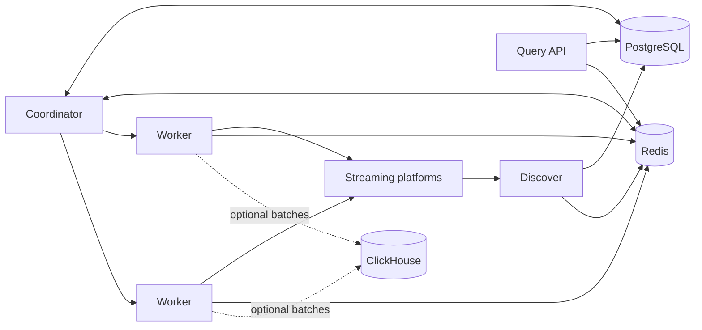

# Meloming Chat Collector

A distributed Go data plane for discovering live channels, assigning them to
workers, collecting public chat events, and serving recent and historical
queries.

This repository is a self-contained release candidate derived from
the former Meloming service. It is prepared both as a portfolio of production
systems work and as a reference implementation for lease-based coordination,
graceful connection handoff, bounded buffering, and multi-store ingestion.

> This is not a hosted service or an officially supported SDK for any streaming
> platform. Read [DISCLAIMER.md](DISCLAIMER.md) before using a connector.

## Project status

The Meloming service has ended. This repository is maintained as a portfolio
and technical reference, while its code remains available for reuse under the
AGPL-3.0-only license. External code contributions and pull requests are not
accepted.

## What is included

- CHZZK, SOOP, and CI.ME live-channel discovery and chat connectors
- Redis lease-based leader election and worker command delivery
- Least-loaded channel assignment with draining-worker handoff
- Redis Streams for bounded recent-message access and handoff deduplication
- PostgreSQL state, broadcast history, and collection opt-outs
- Optional ClickHouse batching for durable analytical history
- gRPC query/admin APIs generated from the included Protobuf definitions
- Prometheus metrics, health probes, cleanup, and export utilities

The user-facing ranking website and its presentation layer are intentionally out
of scope. This repository focuses on the ingestion, coordination, storage, and
query data plane.

## Architecture



- **Discover** finds live channels, records lifecycle state, and emits viewer
  history. A leased leader prevents duplicate full scans.
- **Coordinator** monitors worker heartbeats, assigns pending channels to the
  least-loaded healthy worker, and coordinates graceful drain handoffs.
- **Worker** owns platform connections, normalizes events, and publishes bounded
  per-channel and firehose streams. Overlapping handoffs use short-lived atomic
  deduplication.
- **Query** exposes channel and history operations over gRPC and HTTP.

The design rationale is documented in [Architecture](docs/architecture.md),
[Coordination](docs/design/coordination.md), [Storage](docs/design/storage.md),
[Reliability](docs/design/reliability.md), and the
[repository guide](docs/repository-layout.md).

## Repository layout

| Path | Responsibility |
| --- | --- |
| `discover/` | Channel discovery, lifecycle tracking, and viewer history |
| `coordinator/` | Worker health, assignment, draining, and handoff |
| `worker/` | Platform connections and chat ingestion |
| `query/` | gRPC and HTTP query/admin operations |
| `shared/` | Models, stores, migrations, buffering, and shared middleware |
| `proto/` | Source Protobuf definitions and generated Go bindings |
| `cleanup/` | Retention and stale-state cleanup utility |
| `chat-exporter/` | Object-storage export utility |
| `postgresql/` | Generic PostgreSQL image and migration runner |

See the [repository guide](docs/repository-layout.md) for the file-level layout,
module boundaries, entry points, generated code, and migrations.

## Development

Requirements:

- Go 1.27.0 or newer within the Go 1.27 release line
- Buf CLI 1.x when changing Protobuf definitions
- Redis and PostgreSQL for service-level integration
- ClickHouse only for optional analytical-history paths

Generate and validate the source:

```sh
(cd proto && buf lint && buf generate)
for module in proto shared chat-exporter cleanup coordinator discover query worker; do
  (cd "$module" && GOWORK=off go test ./...)
done
```

## License

This project is licensed under the
[GNU Affero General Public License v3.0 only](LICENSE) (`AGPL-3.0-only`).
